# 📚 Documentación de Vistas - T1 Component Library

Este documento describe cada una de las vistas/páginas disponibles en la aplicación.

---

## 📑 Índice de Contenido

### Páginas

| Página                            | Ruta         | Acceso      | Descripción                   |
| --------------------------------- | ------------ | ----------- | ----------------------------- |
| [Home](#-home)                    | `/`          | Público     | Showcase de componentes       |
| [Dashboard](#-dashboard)          | `/dashboard` | Público     | Estadísticas de interacciones |
| [Docs](#-documentación)           | `/docs`      | Público     | Documentación de componentes  |
| [Exports](#-exportación-de-datos) | `/exports`   | Autenticado | Exportar datos                |
| [Login](#-login)                  | `/login`     | Público     | Inicio de sesión              |
| [Register](#-registro)            | `/register`  | Público     | Registro de usuarios          |
| [Status](#-estado-del-sistema)    | `/status`    | Público     | Monitoreo de servicios        |

### Componentes Globales

| Componente                                            | Archivo                    | Descripción                   |
| ----------------------------------------------------- | -------------------------- | ----------------------------- |
| [Navbar](#-navbar)                                    | `components/Navbar.tsx`    | Barra de navegación principal |
| [Sistema de Temas](#-sistema-de-temas-darklight-mode) | `context/ThemeContext.tsx` | Gestión de modo claro/oscuro  |

---

## 🏠 Home

**Ruta:** `/`  
**Archivo:** `app/page.tsx`  
**Acceso:** Público

### Descripción

Página principal de la aplicación que sirve como **showcase interactivo** de todos los componentes disponibles en la biblioteca. Es el punto de entrada donde los usuarios pueden explorar y probar cada componente.

### Secciones

| Sección                 | Descripción                                                                          |
| ----------------------- | ------------------------------------------------------------------------------------ |
| **HeaderSection**       | Encabezado con título y descripción de la biblioteca                                 |
| **ButtonSection**       | Demostración de variantes de botones (Primary, Secondary, Accent, Destructive, etc.) |
| **InputSection**        | Ejemplos de campos de entrada con validación y estados                               |
| **CardSection**         | Showcase de tarjetas con diferentes estilos (bordered, elevated, hoverable)          |
| **ModalSection**        | Demostración de modales en diferentes tamaños (sm, md, lg)                           |
| **DesignTokensSection** | Visualización de tokens de diseño: colores, tipografía y espaciado                   |

### Características

- ✅ Tracking de interacciones en tiempo real
- ✅ Componentes interactivos funcionales
- ✅ Diseño responsive
- ✅ Animaciones suaves

### Captura de Pantalla

<!-- TODO: Insertar captura de pantalla -->

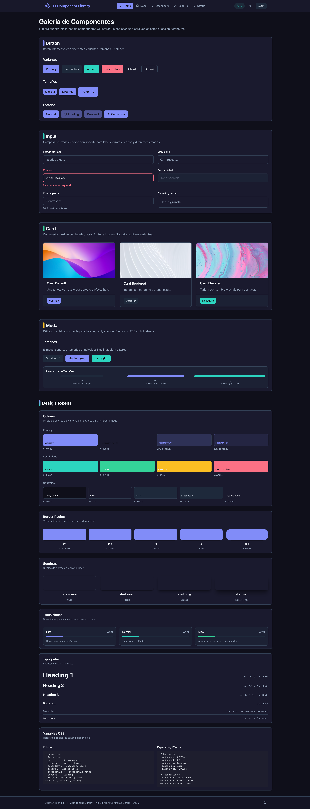

---

## 📊 Dashboard

**Ruta:** `/dashboard`  
**Archivo:** `app/dashboard/page.tsx`  
**Acceso:** Público

### Descripción

Panel de estadísticas que muestra un **resumen visual** de todas las interacciones realizadas con los componentes de la biblioteca. Proporciona métricas en tiempo real y análisis de uso.

### Métricas Mostradas

| Métrica                 | Descripción                                              |
| ----------------------- | -------------------------------------------------------- |
| **Total Eventos**       | Número total de interacciones registradas                |
| **Usuarios Auth**       | Cantidad de eventos de usuarios autenticados             |
| **Usuarios Anónimos**   | Cantidad de eventos de usuarios anónimos                 |
| **Componentes Activos** | Número de componentes diferentes que han sido utilizados |

### Visualizaciones

1. **Gráfico de Barras** - Eventos por componente
2. **Gráfico Donut** - Distribución por tipo de usuario (Autenticado vs Anónimo)
3. **Tabla de Detalle** - Acciones específicas por componente con porcentajes

### Características

- ✅ Datos en tiempo real desde el servidor
- ✅ Indicador de actualización automática
- ✅ Estado de carga con skeleton
- ✅ Visualizaciones SVG nativas

### Captura de Pantalla

<!-- TODO: Insertar captura de pantalla -->

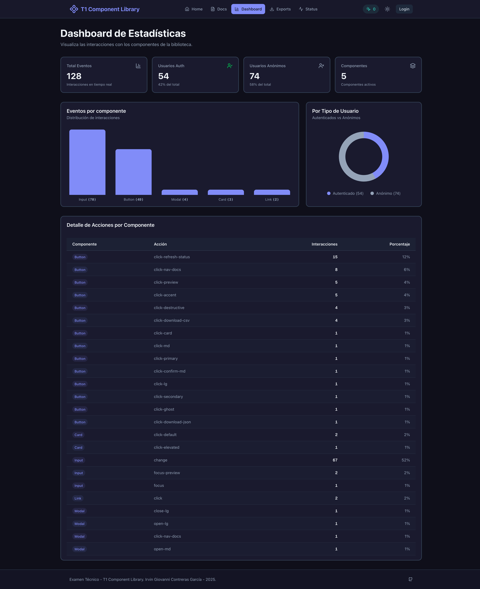

---

## 📖 Documentación

**Ruta:** `/docs`  
**Archivo:** `app/docs/page.tsx`  
**Acceso:** Público

### Descripción

Página de **documentación técnica** de los componentes de la biblioteca. Incluye guías de uso, tablas de props y ejemplos de código para cada componente.

### Componentes Documentados

| Componente | Descripción                                                  |
| ---------- | ------------------------------------------------------------ |
| **Button** | Botones con múltiples variantes, tamaños y estados           |
| **Input**  | Campos de entrada con validación, iconos y mensajes de error |
| **Card**   | Contenedores con header, body y footer                       |
| **Modal**  | Diálogos modales en tres tamaños diferentes                  |

### Estructura de Documentación

Para cada componente se muestra:

- 📝 **Descripción** del componente
- 👁️ **Vista Previa** interactiva
- 📋 **Tabla de Props** con tipos, defaults y descripciones
- 💻 **Ejemplo de Código** con syntax highlighting

### Características

- ✅ Navegación lateral sticky
- ✅ Previews interactivos funcionales
- ✅ Código formateado estilo IDE
- ✅ Tracking de interacciones en previews

### Captura de Pantalla

<!-- TODO: Insertar captura de pantalla -->

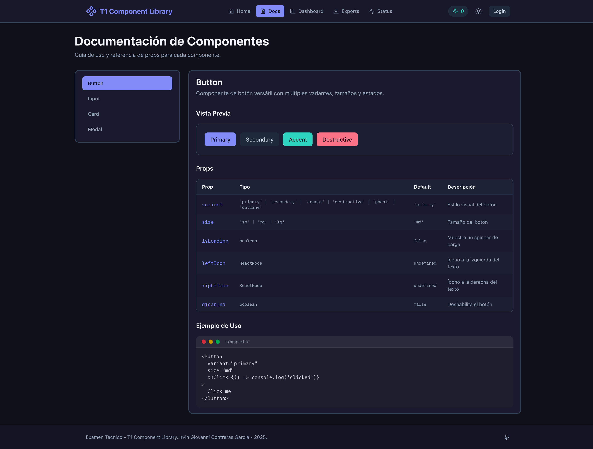

---

## 📤 Exportación de Datos

**Ruta:** `/exports`  
**Archivo:** `app/exports/page.tsx`  
**Acceso:** 🔒 **Requiere autenticación**

### Descripción

Página para **exportar los datos** de interacciones registrados. Permite descargar la información en diferentes formatos para análisis externo.

### Formatos de Exportación

| Formato  | Descripción                                                  | Icono |
| -------- | ------------------------------------------------------------ | ----- |
| **CSV**  | Comma-Separated Values - Compatible con Excel/Sheets         | 📄    |
| **JSON** | JavaScript Object Notation - Para procesamiento programático | 📋    |

### Datos Exportados

Cada registro incluye:

- Nombre del componente
- Acción realizada
- Fecha y hora
- Tipo de usuario (Registrado/Anónimo)
- Nombre y email del usuario (si aplica)

### Vista Previa

- Tabla paginada con los últimos registros
- Navegación entre páginas
- Indicador de total de registros

### Características

- ✅ Descarga directa de archivos
- ✅ Vista previa paginada
- ✅ Protección por autenticación
- ✅ Redirección a login si no autenticado

### Captura de Pantalla

<!-- TODO: Insertar captura de pantalla -->

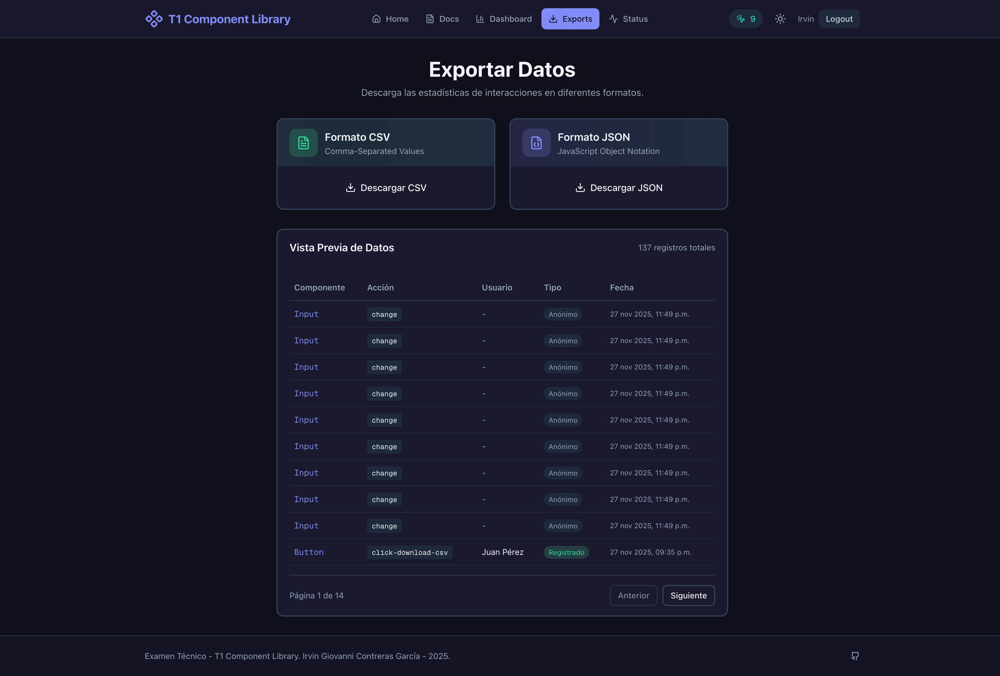

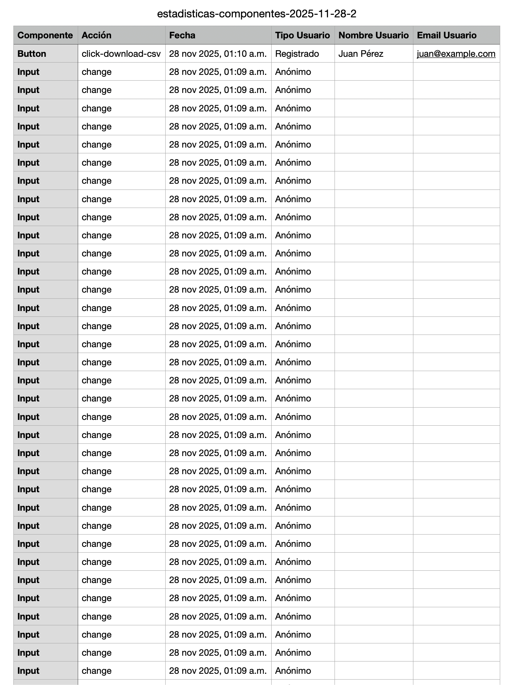

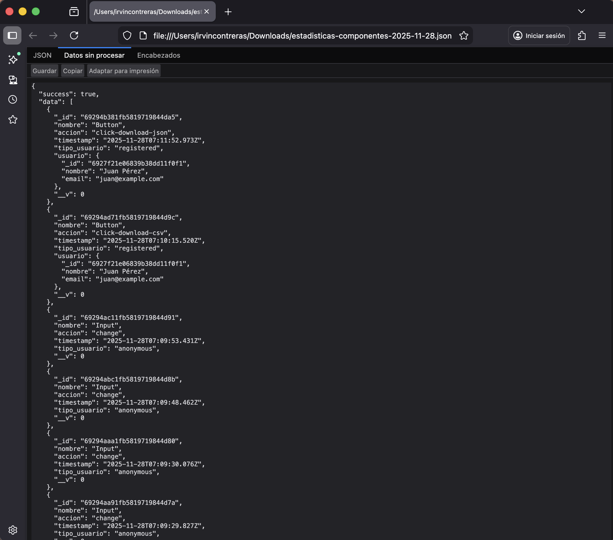

---

## 🔐 Login

**Ruta:** `/login`  
**Archivo:** `app/login/page.tsx`  
**Acceso:** Público (redirige si ya autenticado)

### Descripción

Página de **inicio de sesión** para usuarios registrados. Permite acceder a funcionalidades protegidas como la exportación de datos.

### Campos del Formulario

| Campo          | Tipo       | Validación                      |
| -------------- | ---------- | ------------------------------- |
| **Email**      | `email`    | Requerido, formato email válido |
| **Contraseña** | `password` | Requerido, mínimo 6 caracteres  |

### Características

- ✅ Validación en tiempo real con `react-hook-form`
- ✅ Iconos en campos de entrada
- ✅ Mensajes de error descriptivos
- ✅ Estado de carga en botón
- ✅ Link a registro
- ✅ Redirección automática si ya está autenticado
- ✅ Diseño con gradiente de fondo

### Captura de Pantalla

<!-- TODO: Insertar captura de pantalla -->

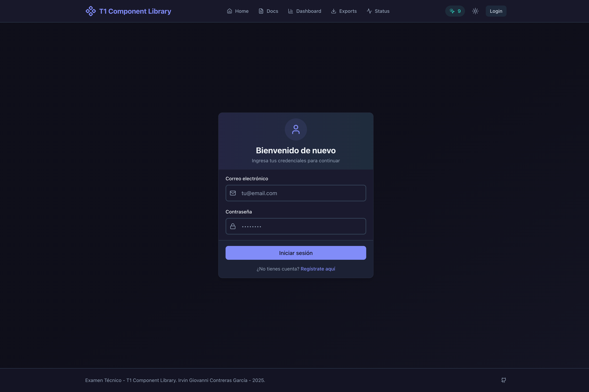

---

## 📝 Registro

**Ruta:** `/register`  
**Archivo:** `app/register/page.tsx`  
**Acceso:** Público (redirige si ya autenticado)

### Descripción

Página de **registro de nuevos usuarios**. Permite crear una cuenta para acceder a funcionalidades autenticadas.

### Campos del Formulario

| Campo                    | Tipo       | Validación                                                                    |
| ------------------------ | ---------- | ----------------------------------------------------------------------------- |
| **Nombre completo**      | `text`     | Requerido, mínimo 2 caracteres                                                |
| **Email**                | `email`    | Requerido, formato email válido                                               |
| **Contraseña**           | `password` | Requerido, mínimo 8 caracteres, debe incluir mayúsculas, minúsculas y números |
| **Confirmar contraseña** | `password` | Requerido, debe coincidir con contraseña                                      |

### Características

- ✅ Validación robusta de contraseña
- ✅ Confirmación de contraseña
- ✅ Texto de ayuda para requisitos de contraseña
- ✅ Estado de carga en botón
- ✅ Link a login
- ✅ Redirección automática al dashboard tras registro
- ✅ Diseño con gradiente accent

### Captura de Pantalla

<!-- TODO: Insertar captura de pantalla -->

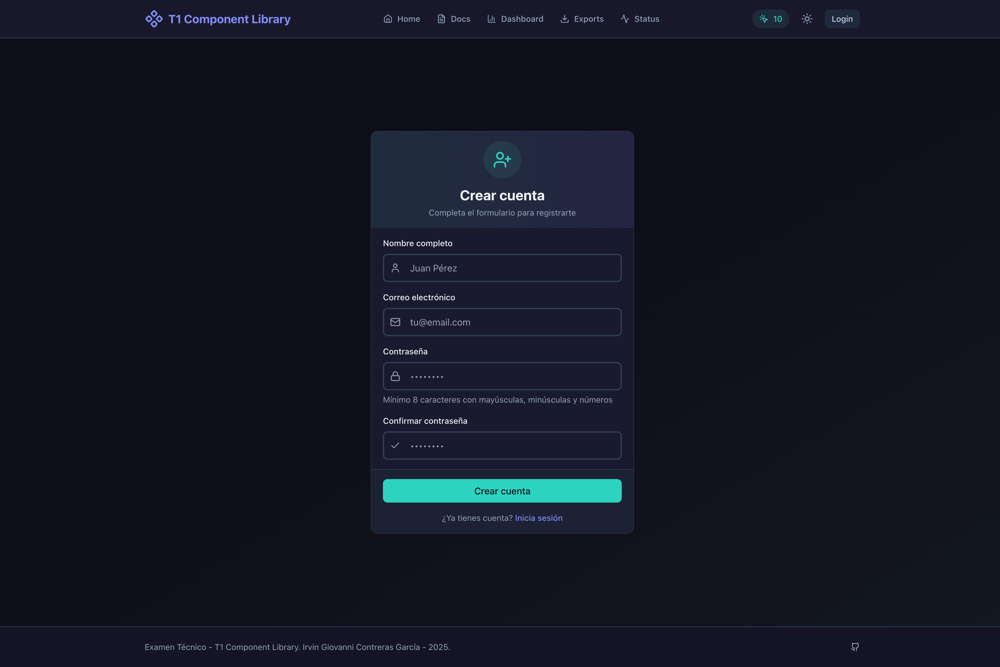

---

## 🖥️ Estado del Sistema

**Ruta:** `/status`  
**Archivo:** `app/status/page.tsx`  
**Acceso:** Público

### Descripción

Página de **monitoreo de servicios** que muestra el estado de salud del sistema en tiempo real. Útil para verificar la disponibilidad de la API y base de datos.

### Información Mostrada

#### Estado General

- Indicador visual de estado (✅ En línea / ❌ Sin conexión / ⏳ Verificando)
- Conteo de servicios disponibles

#### Servicios Monitoreados

| Servicio    | Descripción                 |
| ----------- | --------------------------- |
| **API**     | Estado del servidor backend |
| **MongoDB** | Conexión a base de datos    |

#### Información del Servidor

| Métrica          | Descripción                      |
| ---------------- | -------------------------------- |
| **Estado**       | Saludable / Degradado            |
| **Uptime**       | Tiempo de actividad del servidor |
| **Node.js**      | Versión de Node en uso           |
| **Latencia API** | Tiempo de respuesta en ms        |

#### Uso de Memoria

- Heap Usado
- Heap Total
- RSS (Resident Set Size)

### Características

- ✅ Actualización manual con botón refresh
- ✅ Indicador de latencia por servicio
- ✅ Timestamp de última verificación
- ✅ Indicadores de color por estado
- ✅ Información detallada de memoria
- ✅ Estado de base de datos MongoDB

### Captura de Pantalla

<!-- TODO: Insertar captura de pantalla -->

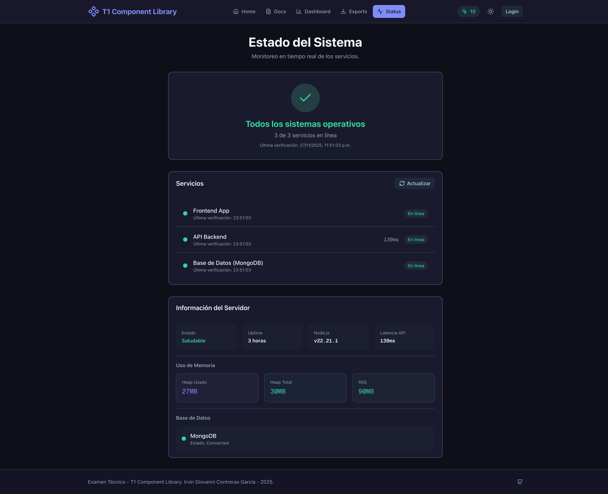

---

## 🧭 Navbar

**Archivo:** `app/components/Navbar.tsx`  
**Ubicación:** Persistente en todas las páginas

### Descripción

Barra de navegación principal que se mantiene **fija en la parte superior** de todas las páginas. Proporciona acceso rápido a todas las secciones de la aplicación y controles globales.

### Características

- ✅ Sticky positioning con backdrop blur
- ✅ Indicador visual de página activa
- ✅ Navegación responsive (desktop/mobile)
- ✅ Menú hamburguesa animado en móvil
- ✅ Contador de interacciones en tiempo real
- ✅ Integración con sistema de autenticación
- ✅ Toggle de tema claro/oscuro

### Estados del Usuario

| Estado             | Visualización                       |
| ------------------ | ----------------------------------- |
| **No autenticado** | Botón "Login" visible               |
| **Autenticado**    | Nombre del usuario + botón "Logout" |

### Captura de Pantalla

<!-- TODO: Insertar capturas de pantalla -->

**Desktop:**

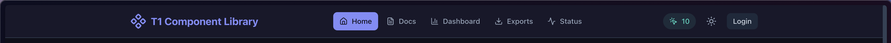

**Mobile (menú abierto):**

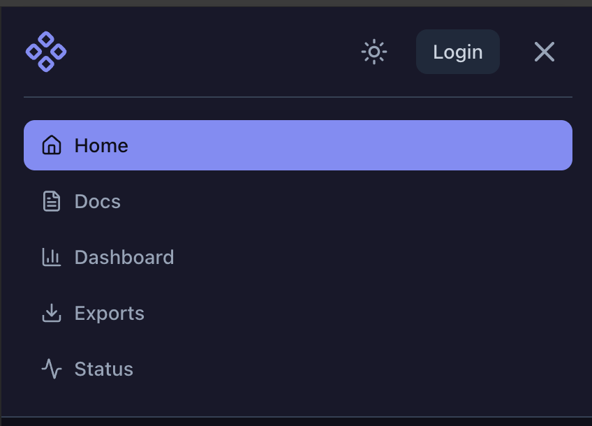

---

## 🌓 Sistema de Temas (Dark/Light Mode)

**Archivo:** `app/context/ThemeContext.tsx`  
**Tipo:** Context Provider + Hook

### Descripción

Sistema de **gestión de temas** que permite alternar entre modo claro y oscuro. Soporta la preferencia del sistema operativo y persiste la selección del usuario.

### Toggle en Navbar

El botón de toggle muestra:

- ☀️ **Sun** cuando está en modo oscuro (para cambiar a claro)
- 🌙 **Moon** cuando está en modo claro (para cambiar a oscuro)

### Captura de Pantalla

<!-- TODO: Insertar capturas de pantalla -->

**Modo Claro (Light):**

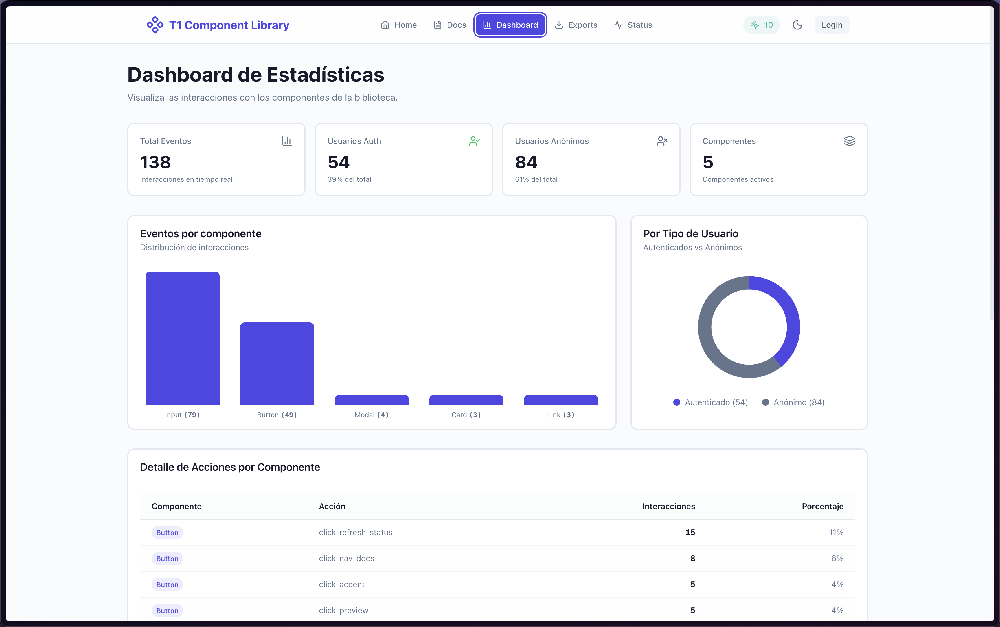

**Modo Oscuro (Dark):**

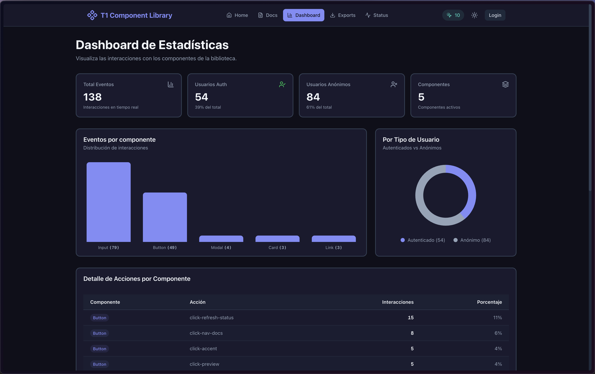

---

_Última actualización: Noviembre 2025_
