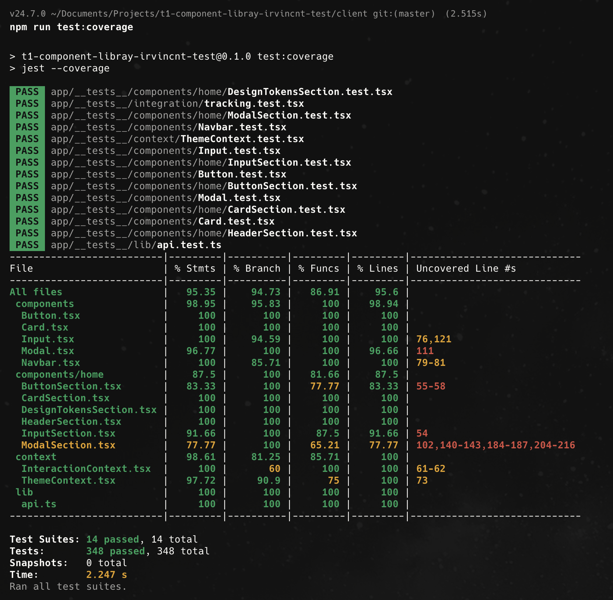

# T1 Component Library - Cliente

Aplicación web desarrollada con Next.js 16 que sirve como showcase interactivo de una librería de componentes con sistema de tracking de interacciones.

## 🛠️ Stack Tecnológico

### Core

| Tecnología     | Versión | Descripción                                   |
| -------------- | ------- | --------------------------------------------- |
| **Next.js**    | 16.0.4  | Framework de React para aplicaciones web      |
| **React**      | 19.2.0  | Librería para construir interfaces de usuario |
| **TypeScript** | 5.x     | Superset tipado de JavaScript                 |

### Estilos

| Tecnología       | Versión | Descripción                      |
| ---------------- | ------- | -------------------------------- |
| **Tailwind CSS** | 4.x     | Framework CSS utility-first      |
| **PostCSS**      | -       | Transformador de CSS con plugins |

### Estado y Data Fetching

| Tecnología               | Versión | Descripción                           |
| ------------------------ | ------- | ------------------------------------- |
| **TanStack React Query** | 5.90.11 | Manejo de estado del servidor y cache |
| **Zustand**              | 5.0.8   | Gestión de estado global ligera       |
| **React Hook Form**      | 7.66.1  | Manejo de formularios performante     |

### UI & Iconos

| Tecnología       | Versión | Descripción             |
| ---------------- | ------- | ----------------------- |
| **Lucide React** | 0.555.0 | Iconos SVG consistentes |

### Testing

| Tecnología          | Versión | Descripción                          |
| ------------------- | ------- | ------------------------------------ |
| **Jest**            | 29.7.0  | Framework de testing                 |
| **Testing Library** | 16.3.0  | Utilidades para testing de React     |
| **ts-jest**         | 29.4.5  | Preprocessor de TypeScript para Jest |

## 📁 Estructura del Proyecto

```
client/
├── app/
│   ├── __tests__/              # Tests unitarios e integración
│   │   ├── components/         # Tests de componentes
│   │   │   ├── home/           # Tests de secciones del home
│   │   │   ├── Button.test.tsx
│   │   │   ├── Card.test.tsx
│   │   │   ├── Input.test.tsx
│   │   │   ├── Modal.test.tsx
│   │   │   └── Navbar.test.tsx
│   │   ├── context/            # Tests de contextos
│   │   ├── integration/        # Tests de integración
│   │   └── lib/                # Tests de utilidades
│   │
│   ├── components/             # Componentes reutilizables
│   │   ├── home/               # Secciones de la página principal
│   │   │   ├── ButtonSection.tsx
│   │   │   ├── CardSection.tsx
│   │   │   ├── DesignTokensSection.tsx
│   │   │   ├── HeaderSection.tsx
│   │   │   ├── InputSection.tsx
│   │   │   ├── ModalSection.tsx
│   │   │   └── index.ts
│   │   ├── Button.tsx          # Componente Button
│   │   ├── Card.tsx            # Componente Card
│   │   ├── Input.tsx           # Componente Input
│   │   ├── Modal.tsx           # Componente Modal
│   │   ├── Navbar.tsx          # Navegación principal
│   │   └── index.ts            # Barrel exports
│   │
│   ├── context/                # Contextos de React
│   │   ├── InteractionContext.tsx  # Contexto de tracking
│   │   └── ThemeContext.tsx        # Contexto de tema (dark/light)
│   │
│   ├── hooks/                  # Custom Hooks
│   │   ├── useExportView.ts    # Hook para vista de exportación
│   │   ├── useHealthCheck.ts   # Hook para estado del servidor
│   │   └── index.ts
│   │
│   ├── lib/                    # Utilidades y servicios
│   │   └── api.ts              # Cliente API (fetch wrapper)
│   │
│   ├── store/                  # Estado global (Zustand)
│   │   └── authStore.ts        # Store de autenticación
│   │
│   ├── dashboard/              # Página del dashboard
│   │   └── page.tsx
│   ├── docs/                   # Documentación de componentes
│   │   ├── comDocs.ts          # Datos de documentación
│   │   └── page.tsx
│   ├── exports/                # Vista de exportación de datos
│   │   └── page.tsx
│   ├── login/                  # Página de inicio de sesión
│   │   └── page.tsx
│   ├── register/               # Página de registro
│   │   └── page.tsx
│   ├── status/                 # Estado del servidor
│   │   └── page.tsx
│   │
│   ├── globals.css             # Estilos globales
│   ├── layout.tsx              # Layout principal
│   ├── providers.tsx           # Proveedores de contexto
│   └── page.tsx                # Página principal (showcase)
│
├── coverage/                   # Reportes de cobertura
├── public/                     # Archivos estáticos
├── jest.config.js              # Configuración de Jest
├── jest.setup.ts               # Setup de Jest
├── next.config.ts              # Configuración de Next.js
├── tailwind.config.ts          # Configuración de Tailwind
├── tsconfig.json               # Configuración de TypeScript
└── package.json
```

## 🔐 Variables de Entorno

Crea un archivo `.env.local` en la raíz del proyecto `client/`:

```bash
# API del servidor
NEXT_PUBLIC_API_URL=http://localhost:3001/api
```

### Variables Disponibles

| Variable              | Descripción               | Valor por Defecto           |
| --------------------- | ------------------------- | --------------------------- |
| `NEXT_PUBLIC_API_URL` | URL base del servidor API | `http://localhost:3001/api` |

> **Nota:** Las variables con prefijo `NEXT_PUBLIC_` son accesibles en el cliente (navegador).

## 🚀 Instalación y Ejecución

### Requisitos Previos

- Node.js 18.x o superior
- npm 9.x o superior

### Instalación

```bash
# Navegar al directorio del cliente
cd client

# Instalar dependencias
npm install
```

### Comandos Disponibles

```bash
# Desarrollo (hot reload)
npm run dev

# Construir para producción
npm run build

# Ejecutar versión de producción
npm start

# Ejecutar linter
npm run lint
```

La aplicación estará disponible en [http://localhost:3000](http://localhost:3000)

## 🧪 Testing

El proyecto utiliza **Jest** y **Testing Library** para las pruebas.

### Ejecutar Tests

```bash
# Ejecutar todos los tests
npm test

# Ejecutar tests en modo watch (desarrollo)
npm run test:watch

# Ejecutar tests con reporte de cobertura
npm run test:coverage
```

### Configuración de Coverage

El proyecto tiene configurado un umbral mínimo de cobertura del **80%** para:

- Branches (ramas)
- Functions (funciones)
- Lines (líneas)
- Statements (declaraciones)



### Estructura de Tests

```
__tests__/
├── components/           # Tests de componentes UI
│   ├── home/             # Tests de secciones del home
│   ├── Button.test.tsx
│   ├── Card.test.tsx
│   ├── Input.test.tsx
│   ├── Modal.test.tsx
│   └── Navbar.test.tsx
├── context/              # Tests de contextos React
│   └── ThemeContext.test.tsx
├── integration/          # Tests de integración
│   └── tracking.test.tsx
└── lib/                  # Tests de utilidades
    └── api.test.ts
```

## 📄 Páginas de la Aplicación

| Ruta         | Descripción                  | Autenticación |
| ------------ | ---------------------------- | ------------- |
| `/`          | Showcase de componentes      | No            |
| `/docs`      | Documentación de componentes | No            |
| `/status`    | Estado del servidor          | No            |
| `/login`     | Inicio de sesión             | No            |
| `/register`  | Registro de usuario          | No            |
| `/dashboard` | Panel de estadísticas        | No            |
| `/exports`   | Vista de datos exportados    | Sí            |

## 📦 Scripts de npm

| Script          | Comando           | Descripción                    |
| --------------- | ----------------- | ------------------------------ |
| `dev`           | `next dev`        | Inicia servidor de desarrollo  |
| `build`         | `next build`      | Compila para producción        |
| `start`         | `next start`      | Inicia servidor de producción  |
| `lint`          | `eslint`          | Analiza código con ESLint      |
| `test`          | `jest`            | Ejecuta suite de tests         |
| `test:watch`    | `jest --watch`    | Tests en modo observación      |
| `test:coverage` | `jest --coverage` | Tests con reporte de cobertura |

## 📜 Licencia

ISC
